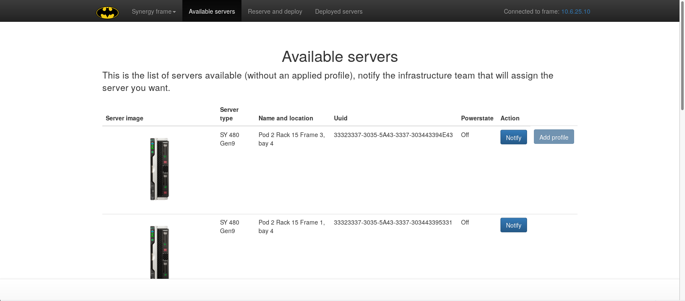
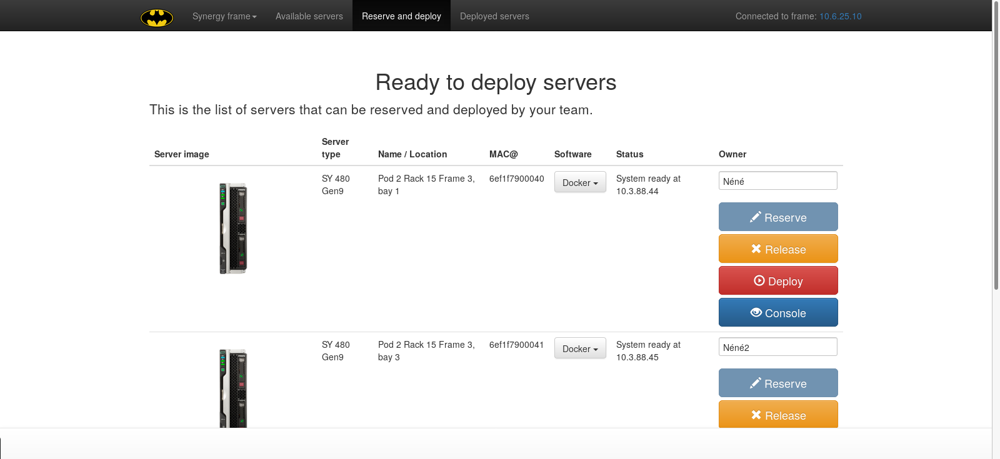
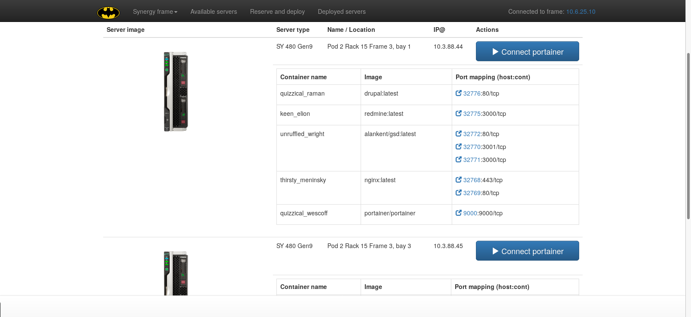

# synergydemo

A small application to highlight HPE Synergy hardware and especially the Oneview unified API.<br/>
This is a home made application that allows user to reserve, deploy and run containers on the underlying hardware.

This application mainly uses python flask, flask-sockets, oneview and docker libraries.<br/>
A WSGI server is recommended to run the application. That's the reason why gunicorn is a dependencies.

# Screenshots
* Available servers.

* Reserve and deploy.

* Deployed servers.



# Prerequisites
* Configure isc-dhcpd using the configuration file provided in the conf directory.
* Configure tftp to boot iPXE.
* Configure a http server to provide the static repository files.
* Copy from DVD a Centos 7 repository.
* Add kickstart ks.txt provided in the conf directory within the Centos 7 repository.

# Installation
* Install git, virtualenv and virtualenvwrapper.
```
apt-get install git python-virtualenv virtualenvwrapper
```
* Clone the repository.
```
git clone https://github.com/uggla/synergydemo.git
```
* Create a virtual env.
```
mkvirtualenv synergy
```
* Install dependencies.
```
pip install -r requirements.txt
```
* Export OVLOGIN and OVPASSWD to supply credentials to your Oneview instance.
* Run the server.
```
./run_server.sh
```
